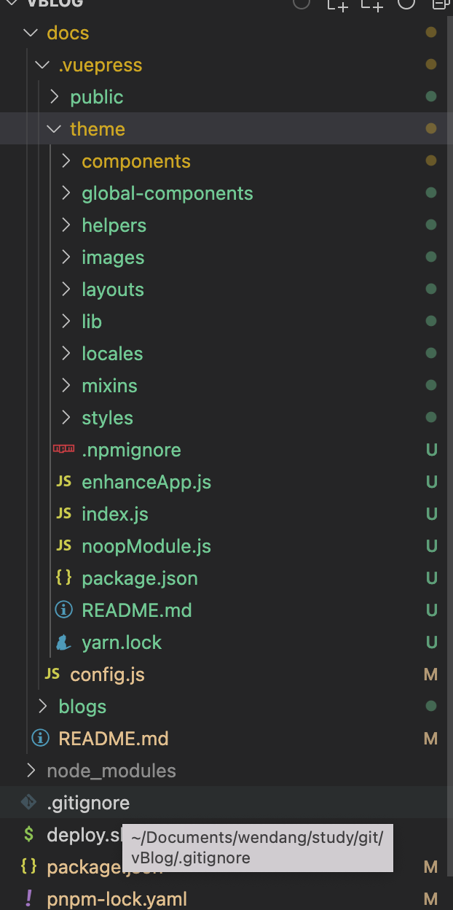

::: tip 介绍
使用vuepress搭建的第一篇博客<br>
:::

<!-- more -->


[vuePress](https://www.vuepress.cn/guide/getting-started.html)

# 快速上手
## 快速上手

1. 创建一个项目路

```javascript
mkdir vuepress-starter && cd vuepress-starter
```

2.使用你喜欢的包管理器进行初始化

```javascript
yarn init # npm init
```

1. 将 VuePress 安装为本地依赖（不推荐全局安装）

```javascript
yarn add -D vuepress # npm install -D vuepress
```

1. 创建你的第一篇文档

```javascript
mkdir docs && echo '# Hello VuePress' > docs/README.md
```

1. 在 package.json 中添加一些 [scripts](https://classic.yarnpkg.com/zh-Hans/docs/package-json#toc-scripts)

```javascript
{
  "scripts": {
    "docs:dev": "vuepress dev docs",
    "docs:build": "vuepress build docs"
  }
}
```

1. 在本地启动服务器

```shell
yarn docs:dev # npm run docs:dev
```

VuePress 会在 [http://localhost:8080(opens new window)](http://localhost:8080/)启动一个热重载的开发服务器


## 基本配置

[主题设置](https://www.vuepress.cn/theme/default-theme-config.html#首页)

docs/.vuepress/config.js

```shell
module.exports = {
    title: "RJY",
    description: "This is a blog.",
    base: '/vBlog/',  // 这是部署到github相关的配置 下面会讲
    markdown: {
        lineNumbers: true // 代码块显示行号
    },
    themeConfig:{
        sidebar: 'auto',//自动获取侧边栏内容
        sidebar:{
            "/node/":[
              ["", "node目录"],
              ["path", "作为前端也需要知道的路径知识"],
              ["stream", "node核心模块-stream"]
            ],
            "/web/":[
              ["", "前端"],
              {
                title: "css",
                name: "css",
                collabsable: false,
                children: [
                  ["css/", "目录"],
                  ['css/1', "css常考面试题"]
                ]
              }
            ]
          },
        nav: [{text: "主页", link: "/"      },
            { text: "node", link: "/node/" },
            { text: "前端", 
              items: [ 
                { text: "html", link:"/web/html/"},
                { text: "css", link:"/web/css/"},
                ]
            },
            { text: "数据库", link: "/database/"   },
            { text: "android", link: "/android/"   },
            { text: "面试问题", link: "/interview/" }
          ],
      }
}
```

## 部署


在项目根目录下创建 deploy.sh

```shell
#!/usr/bin/env sh

# 确保脚本抛出遇到的错误
set -e

# 生成静态文件
npm run docs:build

# 进入生成的文件夹
cd docs/.vuepress/dist

# 如果是发布到自定义域名
# echo 'www.example.com' > CNAME

git init
git add -A
git commit -m 'deploy'

# 如果发布到 https://<USERNAME>.github.io
# git push -f git@github.com:<USERNAME>/<USERNAME>.github.io.git master

# 如果发布到 https://<USERNAME>.github.io/<REPO>
git push -f git@github.com:rjy92/vBlog.git master:gh-pages

cd -
```

然后在package.json中添加

```shell
"scripts": {
    "deploy": "bash deploy.sh",
  },
```

此时注意报错信息 ，可能未设置sshKey

# 使用模版
::: warning
vuepress-theme-reco版本的选取
最新版本，1.6.4 在使用过程中，无法主动加载@vuepress-reco/vuepress-plugin-loading-page插件，
目前自己使用版本降为1.5.5
:::

## 更换主题为本地

- 与hexo不一样，正常的主题文件会被安装到node_modules文件夹中。如果之前vuepress-theme-reco安装正确的话，可以在node_modules文件夹中找到改文件。所以如果不把主题文件放到本地，我们每次执行**npm install**的时候，新的文件就会把我们魔改过的文件覆盖掉。
- 将node_modules 中复制(vuepress-theme-reco),更改为theme,粘贴到.vuepress文件即可
- 查看config文件内容，若没有指定主题，系统会默认会检查.vuepress/theme。若没有此文件，则直接使用默认主题
- 此时修改完后，整个项目的目录结构




## 改造首页

### 1 背景全屏+箭头引导

这里有一个向下浮动的效果，点击之后会定位到文章列表处，

首页的 README.md 文件页面底部添加js与css来实现，代码如下：

```markdown
---
home: true
all: true
heroText: 愿你保持初心和善良,笑里尽是温暖与坦荡。
tagline: A simple and beautiful vuepress blog theme.
# heroImage: /hero.png
# heroImageStyle: {
#   maxWidth: '600px',
#   width: '100%',
#   display: block,
#   margin: '9rem auto 2rem',
#   background: '#fff',
#   borderRadius: '1rem',
# }
bgImageStyle: {
height: '100vh'
}
isShowTitleInHome: false
actionText: Guide
# actionLink: /views/other/guide
features:
- title: Yesterday
details: 开发一款看着开心、写着顺手的 vuepress 博客主题
- title: Today
details: 希望帮助更多的人花更多的时间在内容创作上，而不是博客搭建上
- title: Tomorrow
details: 希望更多的爱好者能够参与进来，帮助这个主题更好的成长
---
<style>
.anchor-down {
display: block;
margin: 12rem auto 0;
bottom: 45px;
width: 20px;
height: 20px;
font-size: 34px;
text-align: center;
animation: bounce-in 5s 3s infinite;
position: absolute;
left: 50%;
bottom: 30%;
margin-left: -10px;
cursor: pointer;
}
@-webkit-keyframes bounce-in{
0%{transform:translateY(0)}
20%{transform:translateY(0)}
50%{transform:translateY(-20px)}
80%{transform:translateY(0)}
to{transform:translateY(0)}
}
.anchor-down::before {
content: "";
width: 20px;
height: 20px;
display: block;
border-right: 3px solid #fff;
border-top: 3px solid #fff;
transform: rotate(135deg);
position: absolute;
bottom: 10px;
}
.anchor-down::after {
content: "";
width: 20px;
height: 20px;
display: block;
border-right: 3px solid #fff;
border-top: 3px solid #fff;
transform: rotate(135deg);
}
</style>

<script>
export default {
mounted () {
// 删除原主题中的箭头
const yuanDown = document.getElementsByClassName('down-arrow')
yuanDown[0].style.display = 'none'

// 添加新的箭头
const ifJanchor = document.getElementById("JanchorDown"); 
ifJanchor && ifJanchor.parentNode.removeChild(ifJanchor);
let a = document.createElement('a');
a.id = 'JanchorDown';
a.className = 'anchor-down';
document.getElementsByClassName('hero')[0].append(a);
let targetA = document.getElementById("JanchorDown");
targetA.addEventListener('click', e => { // 添加点击事件
this.scrollFn();
})
},
methods: {
scrollFn() {
const windowH = document.getElementsByClassName('hero')[0].clientHeight; // 获取窗口高度
document.documentElement.scrollTop = windowH; // 滚动条滚动到指定位置
}
}
}
</script>
```

### 2 导航栏，颜色切换

修改theme中的代码数据，添加自己的组件

theme/components/Navbar 中的组件

### 3 加入看板

https://vuepress-theme-reco.recoluan.com/views/plugins/kanbanniang.html

使用插件vuepress-plugin-kan-ban-niang

- 安装

```shell
yarn add @vuepress-reco/vuepress-plugin-kan-ban-niang //引入依赖
//或者
pnpm install  @vuepress-reco/vuepress-plugin-kan-ban-niang 
```


- 修改config的配置

```markdown
module.exports = {
  plugins: 
  [
        [
            "@vuepress-reco/vuepress-plugin-kan-ban-niang",
            {
                theme: ["whiteCat"],
                clean: true,
                modelStyle: {
                    position: "fixed",
                    right: "65px",
                    bottom: "0px",
                    zIndex: 99999,
                    pointerEvents: 'none'
                }
            }
        ]
    ]
}
```


### 4 加入音乐插件（bgm player）

```powershell
yarn add @vuepress-reco/vuepress-plugin-bgm-player -D
//或者
npm install @vuepress-reco/vuepress-plugin-bgm-player -D
```

修改config配置

```powershell
module.exports = {
  plugins: 
  [
        [
            '@vuepress-reco/vuepress-plugin-bgm-player',
            {
              audios: [
                {
                  name: 'LOSER',
                  artist: '최낙타',
                  url: 'https://assets.smallsunnyfox.com/music/3.mp3',
                  cover: 'https://assets.smallsunnyfox.com/music/3.jpg'
                }
              ] ,
              // 是否默认缩小
              autoShrink: true ,
              // 缩小时缩为哪种模式
              shrinkMode: 'float',
              // 悬浮窗样式
              floatStyle:{ bottom: '10px', 'z-index': '999999' }
            }
          ]
    ]
}
```