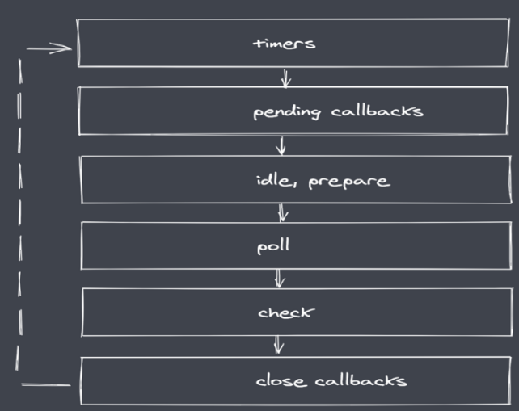

::: tip 摘要
总结：前端node 高级面试题<br>
[饿了么出品node面试题](https://github.com/ElemeFE/node-interview)
<br>
:::

<!-- more -->

##  1 Buffer
Buffer是用来处理二进制数据的，比如图片，mp3,数据库文件等.Buffer支持各种编码解码，二进制字符串互转

Buffer 是 Node.js 中用于处理二进制数据的类, 其中与 IO 相关的操作 (网络/文件等) 均基于 Buffer. Buffer 类的实例非常类似整数数组, **但其大小是固定不变的**, 并且其内存在 V8 堆栈外分配原始内存空间. Buffer 类的实例创建之后, 其所占用的内存大小就不能再进行调整.
在 Node.js v6.x 之后 **new Buffer() 接口开始被废弃**, 理由是参数类型不同会返回不同类型的 Buffer 对象, 所以当开发者没有正确校验参数或没有正确初始化 Buffer 对象的内容时, 以及不了解的情况下初始化 就会在不经意间向代码中引入安全性和可靠性问题

|  接口	 | 用途  |
|  ----  | ----  |
| Buffer.from()	| 根据已有数据生成一个 Buffer 对象  |
| Buffer.alloc()| 	创建一个初始化后的 Buffer 对象  |
| Buffer.allocUnsafe()	| 创建一个未初始化的 Buffer 对象  |

[Buffer](https://www.yuque.com/u12177228/kb/tcc4cf#e823d6a7)
###  新建Buffer会占用V8分配的内存吗
不会，Buffer属于堆外内存，不是V8分配的
### Buffer.alloc和Buffer.allocUnsafe的区别
- Buffer.allocUnsafe创建的 Buffer 实例的底层内存是未初始化的。 新创建的 Buffer 的内容是未知的，可能包含敏感数据。 
- 使用 Buffer.alloc() 可以创建以零初始化的 Buffer 实例
### Buffer的内存分配机制
为了高效的使用申请来的内存，Node采用了slab分配机制。slab是一种动态的内存管理机制。  
Node以8kb为界限来来区分Buffer为大对象还是小对象，如果是小于8kb就是小Buffer，大于8kb就是大Buffer。  
例如第一次分配一个1024字节的Buffer，Buffer.alloc(1024),那么这次分配就会用到一个slab，接着如果继续Buffer.alloc(1024),那么上一次用的slab的空间还没有用完，因为总共是8kb，1024+1024 = 2048个字节，没有8kb，所以就继续用这个slab给Buffer分配空间。  
如果超过8kb，那么直接用C++底层地宫的SlowBuffer来给Buffer对象提供空间。  

## 2  path
使用：**内置模块，require之后直接使用 constpath=require('path')**
- 获取路径/文件名/扩展名
    - 获取路径：path.dirname(filepath)
        - 返回路径中最后一个部分的上一层目录所在路径
    - 获取文件名：path.basename(filepath)
        - 01 返回的就是接收路径当中的最后一部分
        - 02 第二个参数表示扩展名，如果说没有设置则返回完整的文件名称带后缀
        - 03 第二个参数做为后缀时，如果没有在当前路径中被匹配到，那么就会忽略
        - 04 处理目录路径的时候如果说，结尾处有路径分割符，则也会被忽略掉
    - 获取扩展名：path.extname(filepath)
        -   01 返回 path路径中相应文件的后缀名
        -   02 如果 path 路径当中存在多个点，它匹配的是最后一个点，到结尾的内容
- 路径解析
    - path.parse 解析路径 
        - 01 接收一个路径，返回一个对象，包含不同的信息
        - 02 root dir base ext name
            - root当前路径根路径
            - dir 最后一个文件的上层目录
            - base 最后一个部分的完成文件名称
            - ext 文件后缀
            - name 文件名称
    ```javascript
    path.parse('/home/user/dir/file.txt')
    // returns
    // {
    //    root : "/",
    //    dir : "/home/user/dir",
    //    base : "file.txt",
    //    ext : ".txt",
    //    name : "file"
    // }
    ```
- 路径组合
    - path.join([...paths])  (拼接路径)
    - path.resolve([...paths])  (绝对路径)
    ```javascript
    var path = require('path');

    // 假设当前工作路径是 /Users/a/Documents/git-code/nodejs-learning-guide/examples/2016.11.08-node-path

    // 输出 /Users/a/Documents/git-code/nodejs-learning-guide/examples/2016.11.08-node-path
    console.log( path.resolve('') )

    // 输出 /Users/a/Documents/git-code/nodejs-learning-guide/examples/2016.11.08-node-path
    console.log( path.resolve('.') )

    // 输出 /foo/bar/baz
    console.log( path.resolve('/foo/bar', './baz') );

    // 输出 /foo/bar/baz
    console.log( path.resolve('/foo/bar', './baz/') );

    // 输出 /tmp/file
    console.log( path.resolve('/foo/bar', '/tmp/file/') );

    // 输出 /Users/a/Documents/git-code/nodejs-learning-guide/examples/2016.11.08-node-path/www/js/mod.js
    console.log( path.resolve('www', 'js/upload', '../mod.js') );

    ```

## 3 FS
[饿了么团队关于这方面的问题](https://github.com/ElemeFE/node-interview/blob/master/sections/zh-cn/io.md#file)  
[FS](https://www.yuque.com/u12177228/kb/tcc4cf#82d842d5)
- readFile 从指定文件中读取数据
-  writeFile 向指定文件中写入数据
-  appendFile 追加的方式像指定文件中写入数据
-  copyFile 将某个文件中的数据拷贝至另一文件
-  watchFile 对指定文件进行监听

## 4 Events
### 谈谈你对EventEmitter的理解？
EventEmitter是 Node. js中一个实现观察者模式的类，主要功能是订阅和发布消息，用于解决多模块交互而产生的模块之间的耦合问题.  
EventEmitter多用于被继承，而并非直接使用  
EventEmitter中实现了on、emit、once、off、listen等其他功能  

### EventEmitter有哪些典型应用
- 在模块间传递消息。
- 在回调函数内外传递消息。
- 处理流数据，因为流是在 EventEmitter的基础上实现的。
- 运用观察者模式收发消息的相关应用

### Eventemitter 的 emit 是同步还是异步?

Node.js 中 Eventemitter 的 emit 是同步的.

### 浏览器与Node的事件循环(Event Loop)有何区别?

#### 浏览器中的 Event Loop

1. Micro-Task 与 Macro-Task

  事件循环中的异步队列有两种：macro（宏任务）队列和 micro（微任务）队列。**宏任务队列可以有多个，微任务队列只有一个**。	

  - 常见的 macro-task 比如：setTimeout、setInterval、 setImmediate、script（整体代码）、 I/O 操作、UI 渲染等。
  - 常见的 micro-task 比如: process.nextTick、new Promise().then(回调)、MutationObserver(html5 新特性) 等Event Loop 过程

2. Event Loop 过程

  ```js
  Promise.resolve().then(()=>{
    console.log('Promise1')
    setTimeout(()=>{
      console.log('setTimeout2')
    },0)
  })
  setTimeout(()=>{
    console.log('setTimeout1')
    Promise.resolve().then(()=>{
      console.log('Promise2')
    })
  },0)
  ```

最后输出结果是 Promise1，setTimeout1，Promise2，setTimeout2

1. 一开始执行栈的同步任务（这属于宏任务）执行完毕，会去查看是否有微任务队列，上题中存在(有且只有一个)，然后执行微任务队列中的所有任务输出 Promise1，同时会生成一个宏任务 setTimeout2

2. 然后去查看宏任务队列，宏任务 setTimeout1 在 setTimeout2 之前，先执行宏任务 setTimeout1，输出 setTimeout1

3. 在执行宏任务 setTimeout1 时会生成微任务 Promise2 ，放入微任务队列中，接着先去清空微任务队列中的所有任务，输出 Promise2

4. 清空完微任务队列中的所有任务后，就又会去宏任务队列取一个，这回执行的是 setTimeout2

  

#### Node 中的 Event Loop

**注意** 但是node11版本之后和浏览器已经一样了，timers 阶段的setTimeout、setInterval等函数派发的任务、包括 setImmediate 派发的任务，都被修改为：一旦执行完当前阶段的一个任务，就立刻执行微任务队列。）

1. **Node js完整事件环**

- 执行同步代码，将不同的任务添加至相应的队列

- 所有同步代码执行后回去执行满足条件的微任务

- 所有微任务代码执行后会执行timer队列中满足的宏任务

- timer中的所有宏任务执行完成后就会依次切换队列

- 注意：在完成队列切换之前会先清空微任务代码

  

2. **node 中事件循环的6个阶段**



 node 中的事件循环的顺序：

外部输入数据–>轮询阶段(poll)–>检查阶段(check)–>关闭事件回调阶段(close callback)–>定时器检测阶段(timer)–>I/O 事件回调阶段(I/O callbacks)–>闲置阶段(idle, prepare)–>轮询阶段（按照该顺序反复运行）

- timers 阶段：这个阶段执行 timer（setTimeout、setInterval）的回调
- I/O callbacks 阶段：处理一些上一轮循环中的少数未执行的 I/O 回调
- idle, prepare 阶段：仅 node 内部使用
- poll 阶段：获取新的 I/O 事件, 适当的条件下 node 将阻塞在这里
- check 阶段：执行 setImmediate() 的回调
- close callbacks 阶段：执行 socket 的 close 事件回调

注意：**上面六个阶段都不包括 process.nextTick()**


3. **详细介绍timer，poll，check 阶段**

- **timer**

>timers 阶段会执行 setTimeout 和 setInterval 回调，并且是由 poll 阶段控制的。同样，**在 Node 中定时器指定的时间也不是准确时间，只能是尽快执行**。

- **poll**

poll 是一个至关重要的阶段，这一阶段中，系统会做两件事情
>- 回到 timer 阶段执行回调
>- 执行 I/O 回调
并且在进入该阶段时如果没有设定了 timer 的话，会发生以下两件事情
>- 如果 poll 队列不为空，会遍历回调队列并同步执行，直到队列为空或者达到系统限制
>- 如果 poll 队列为空时，会有两件事发生
>   - 如果有 setImmediate 回调需要执行，poll 阶段会停止并且进入到 check 阶段执行回调
>   - 如果没有 setImmediate 回调需要执行，会等待回调被加入到队列中并立即执行回调，这里同样会有个超时时间设置防止一直等待下去

- **check 阶段**

>setImmediate()的回调会被加入 check 队列中，从 event loop 的阶段图可以知道，check 阶段的执行顺序在 poll 阶段之后


举例:

```js
console.log('start')
setTimeout(() => {
  console.log('timer1')
  Promise.resolve().then(function() {
    console.log('promise1')
  })
}, 0)
setTimeout(() => {
  console.log('timer2')
  Promise.resolve().then(function() {
    console.log('promise2')
  })
}, 0)
Promise.resolve().then(function() {
  console.log('promise3')
})
console.log('end')
//start=>end=>promise3=>timer1=>timer2=>promise1=>promise2
// 在新版本node中，start=>end=>promise3=>timer1=>promise1=>timer2=>promise2
```


**注意**：**process.nextTick**

函数其实是独立于 Event Loop 之外的，它有一个自己的队列，当每个阶段完成后，如果存在 nextTick 队列，就会清空队列中的所有回调函数，并且优先于其他 microtask 执行

```js
setTimeout(() => {
 console.log('timer1')
 Promise.resolve().then(function() {
   console.log('promise1')
 })
}, 0)
process.nextTick(() => {
 console.log('nextTick')
 process.nextTick(() => {
   console.log('nextTick')
   process.nextTick(() => {
     console.log('nextTick')
     process.nextTick(() => {
       console.log('nextTick')
     })
   })
 })
})
// nextTick=>nextTick=>nextTick=>nextTick=>timer1=>promise1
```


#### Node js与浏览器事件环的区别

- 任务队列数不同
    - 浏览器中只有两个任务队列
    - Node js中有6个事件队列

- Node js 微任务执行时机不同
    - 二者都会在同步代码执行完毕后执行微任务
    - 浏览器平台下每当一个宏任务执行完毕后就清空微任务
    - Node js平台在事件队列切换时会去清空微任务

- 微任务优先级不同
    - 浏览器事件环，微任务存放在事件队列，先进先出
    - Node js中**process.nextTick 先于promise.then**


## 5 Stream

### 5.1 简述使用流操作的优势，以及Node中流的分类和特点

流操作是为了解决读写速度不一致、大文件的内存占用率太高的问题而提出的解决方案，使用流操作，可以用流的模式读取数据、写入数据，而不需要占用大量内存，也不需要一次性读取和写入，在空间和时间上节省资源，提高效率

**Node js中流的分类**

- Readable:可读流，能够实现数据的读取
- Writeable:可写流，能够实现数据的写操作
- Duplex:双工流，既可读又可写
- Tranform:转换流，可读可写，还能实现数据转换

**Node js 流的特点**

- Stream 模拟实现了四个具体的抽象
- 所有流都继承自EvenEmitter


### 5.2 pipe

stream 的 `.pipe()`, 将一个可写流附到可读流上, 同时将可写流切换到流模式, 并把所有数据推给可写流. 在 pipe 传递数据的过程中, `objectMode` 是传递引用, 非 `objectMode` 则是拷贝一份数据传递下去.

```js
'use strict'
import {createReadStream, createWriteStream} from 'fs'

createReadStream('/path/to/a/big/file').pipe(createWriteStream('/path/to/the/dest'))
```