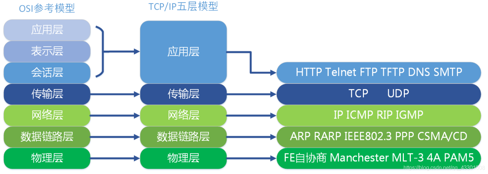
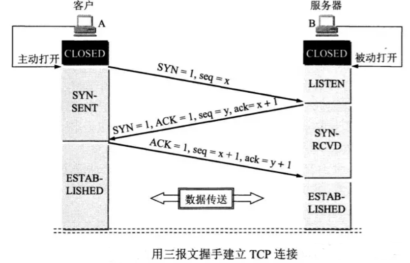
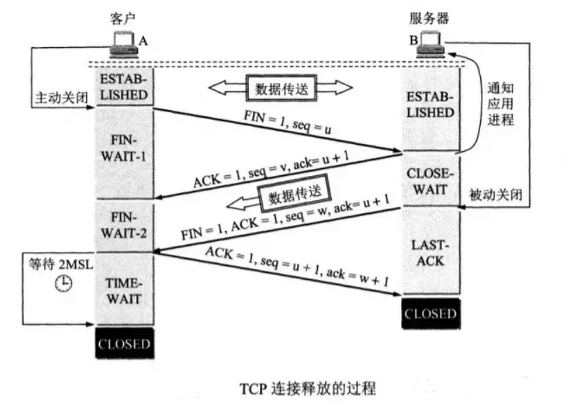
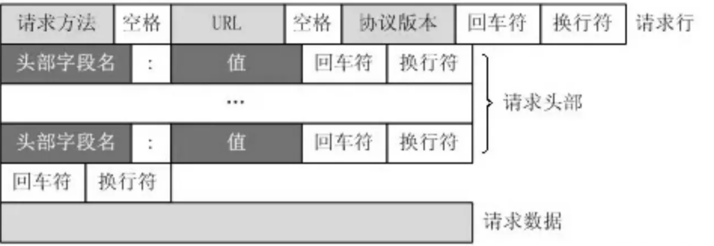
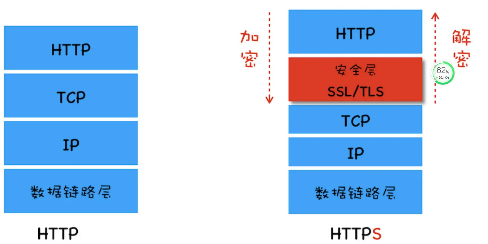
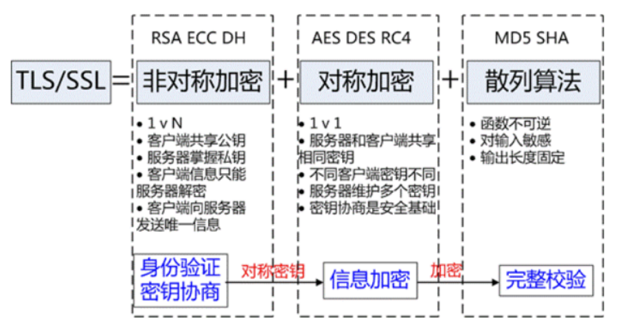

::: tip 摘要
总结：前端网络面试题 
[饿了么出品node面试题](https://github.com/ElemeFE/node-interview)
 
:::

<!-- more -->

## 1 网络模型

### 1OSI七层模型

`ISO`为了更好的使网络应用更为普及，推出了`OSI`参考模型

- 应用层：用户与网络的接口
- 表示层：数据加密、转换、压缩
- 会话层：控制网络连接建立与终止
- 传输层：控制数据传输可靠性
- 网络层：确定目标网络
- 数据链路层：确定目标主机
- 物理层：各种物理设备和标准

## 2 TCP 和 UDP的概念及特点

TCP 和 UDP都是传输层协议，他们都属于TCP/IP协议族

### 2.1 **UDP**

UDP的全称是**用户数据报协议**，在网络中它与TCP协议一样用于处理数据包，是一种无连接的协议

**特点：**

- 面向无连接
- 有单播，多播，广播的功能
- 面向报文
- 不可靠性
- 头部开销小，传输数据报文时是很高效的。

### 2.2 TCP

TCP的全称是传输控制协议是一种面向连接的、可靠的、基于字节流的传输层通信协议。TCP 是面向连接的、可靠的流协议（流就是指不间断的数据结构）

**特点：**

- 面向连接
- 仅支持单播传输
- 面向字节流
- 可靠传输
- 提供拥塞控制
- 提供全双工通信

### 2.3 TCP和UDP的区别

|              | **UDP**                                    | **TCP**                                              |
| ------------ | ------------------------------------------ | ---------------------------------------------------- |
| 是否连接     | 无连接                                     | 面向连接                                             |
| 是否可靠     | 不可靠传输，不使用流量控制和拥塞控制       | 可靠传输（数据顺序和正确性），使用流量控制和拥塞控制 |
| 连接对象个数 | 支持一对一，一对多，多对一和多对多交互通信 | 只能是一对一通信                                     |
| 传输方式     | 面向报文                                   | 面向字节流                                           |
| 首部开销     | 首部开销小，仅8字节                        | 首部最小20字节，最大60字节                           |
| 适用场景     | 适用于实时应用，例如视频会议、直播         | 适用于要求可靠传输的应用，例如文件传输               |

### 2.4  TCP和UDP的使用场景

**TCP应用场景：** 效率要求相对低，但对准确性要求相对高的场景。因为传输中需要对数据确认、重发、排序等操作，相比之下效率没有UDP高。例如：文件传输（准确高要求高、但是速度可以相对慢）、接受邮件、远程登录。

**UDP应用场景：** 效率要求相对高，对准确性要求相对低的场景。例如：QQ聊天、在线视频、网络语音电话（即时通讯，速度要求高，但是出现偶尔断续不是太大问题，并且此处完全不可以使用重发机制）、广播通信（广播、多播）。

### 2.5 TCP的三次握手和四次挥手

#### 2.5.1 三次握手

- 第一次握手：客户端给服务端发一个 SYN 报文，并指明客户端的初始化序列号 ISN，此时客户端处于 SYN_SEND 状态。4

  > 首部的同步位SYN=1，初始序号seq=x，SYN=1的报文段不能携带数据，但要消耗掉一个序号。

- 第二次握手：服务器收到客户端的 SYN 报文之后，会以自己的 SYN 报文作为应答，并且也是指定了自己的初始化序列号 ISN。同时会把客户端的 ISN + 1 作为ACK 的值，表示自己已经收到了客户端的 SYN，此时服务器处于 SYN_REVD 的状态

  > 在确认报文段中SYN=1，ACK=1，确认号ack=x+1，初始序号seq=y

- 第三次握手：客户端收到 SYN 报文之后，会发送一个 ACK 报文，当然，也是一样把服务器的 ISN + 1 作为 ACK 的值，表示已经收到了服务端的 SYN 报文，此时客户端处于 ESTABLISHED 状态。服务器收到 ACK 报文之后，也处于 ESTABLISHED 状态，此时，双方已建立起了连接。

  > 确认报文段ACK=1，确认号ack=y+1，序号seq=x+1（初始为seq=x，第二个报文段所以要+1），ACK报文段可以携带数据，不携带数据则不消耗序号。

##### **那为什么要三次握手呢？两次不行吗？**

- 为了确认双方的接收能力和发送能力都正常

- 如果是用两次握手，则会出现下面这种情况

  > 如客户端发出连接请求，但因连接请求报文丢失而未收到确认，于是客户端再重传一次连接请求。后来收到了确认，建立了连接。数据传输完毕后，就释放了连接，客户端共发出了两个连接请求报文段，其中第一个丢失，第二个到达了服务端，但是第一个丢失的报文段只是在某些网络结点长时间滞留了，延误到连接释放以后的某个时间才到达服务端，此时服务端误认为客户端又发出一次新的连接请求，于是就向客户端发出确认报文段，同意建立连接，不采用三次握手，只要服务端发出确认，就建立新的连接了，此时客户端忽略服务端发来的确认，也不发送数据，则服务端一致等待客户端发送数据，浪费资源。

##### **简单来说就是以下三步**

- **第一次握手：** 客户端向服务端发送连接请求报文段。该报文段中包含自身的数据通讯初始序号。请求发送后，客户端便进入 SYN-SENT 状态。

- **第二次握手：** 服务端收到连接请求报文段后，如果同意连接，则会发送一个应答，该应答中也会包含自身的数据通讯初始序号，发送完成后便进入 SYN-RECEIVED 状态。

- **第三次握手：** 当客户端收到连接同意的应答后，还要向服务端发送一个确认报文。客户端发完这个报文段后便进入 ESTABLISHED 状态，服务端收到这个应答后也进入 ESTABLISHED 状态，此时连接建立成功。

####  2.5.3 四次挥手

刚开始双方都处于 ESTABLISHED 状态，假如是客户端先发起关闭请求。四次挥手的过程如下：

- 第一次挥手： 客户端会发送一个 FIN 报文，报文中会指定一个序列号。此时客户端处于 FIN_WAIT1 状态

  > 即发出连接释放报文段（FIN=1，序号seq=u），并停止再发送数据，主动关闭TCP连接，进入FIN_WAIT1（终止等待1）状态，等待服务端的确认。

- 第二次挥手：服务端收到 FIN 之后，会发送 ACK 报文，且把客户端的序列号值 +1 作为 ACK 报文的序列号值，表明已经收到客户端的报文了，此时服务端处于 CLOSE_WAIT 状态。

  > 即服务端收到连接释放报文段后即发出确认报文段（ACK=1，确认号ack=u+1，序号seq=v），服务端进入CLOSE_WAIT（关闭等待）状态，此时的TCP处于半关闭状态，客户端到服务端的连接释放。客户端收到服务端的确认后，进入FIN_WAIT2（终止等待2）状态，等待服务端发出的连接释放报文段。

- 第三次挥手：如果服务端也想断开连接了，和客户端的第一次挥手一样，发给 FIN 报文，且指定一个序列号。此时服务端处于 LAST_ACK 的状态。

  > 即服务端没有要向客户端发出的数据，服务端发出连接释放报文段（FIN=1，ACK=1，序号seq=w，确认号ack=u+1），服务端进入LAST_ACK（最后确认）状态，等待客户端的确认。

- 第四次挥手：客户端收到 FIN 之后，一样发送一个 ACK 报文作为应答，且把服务端的序列号值 +1 作为自己 ACK 报文的序列号值，此时客户端处于 TIME_WAIT 状态。需要过一阵子以确保服务端收到自己的 ACK 报文之后才会进入 CLOSED 状态，服务端收到 ACK 报文之后，就处于关闭连接了，处于 CLOSED 状态。

  > 即客户端收到服务端的连接释放报文段后，对此发出确认报文段（ACK=1，seq=u+1，ack=w+1），客户端进入TIME_WAIT（时间等待）状态。此时TCP未释放掉，需要经过时间等待计时器设置的时间2MSL后，客户端才进入CLOSED状态。

##### **那为什么需要四次挥手呢？**

> 因为当服务端收到客户端的SYN连接请求报文后，可以直接发送SYN+ACK报文。其中ACK报文是用来应答的，SYN报文是用来同步的。但是关闭连接时，当服务端收到FIN报文时，很可能并不会立即关闭SOCKET，所以只能先回复一个ACK报文，告诉客户端，“你发的FIN报文我收到了”。只有等到我服务端所有的报文都发送完了，我才能发送FIN报文，因此不能一起发送，故需要四次挥手。

##### **简单来说就是以下四步**

- **第一次挥手：** 若客户端认为数据发送完成，则它需要向服务端发送连接释放请求。

- **第二次挥手**：服务端收到连接释放请求后，会告诉应用层要释放 TCP 链接。然后会发送 ACK 包，并进入 CLOSE_WAIT 状态，此时表明客户端到服务端的连接已经释放，不再接收客户端发的数据了。但是因为 TCP 连接是双向的，所以服务端仍旧可以发送数据给客户端。
- **第三次挥手**：服务端如果此时还有没发完的数据会继续发送，完毕后会向客户端发送连接释放请求，然后服务端便进入 LAST-ACK 状态。
- **第四次挥手：** 客户端收到释放请求后，向服务端发送确认应答，此时客户端进入 TIME-WAIT 状态。该状态会持续 2MSL（最大段生存期，指报文段在网络中生存的时间，超时会被抛弃） 时间，若该时间段内没有服务端的重发请求的话，就进入 CLOSED 状态。当服务端收到确认应答后，也便进入 CLOSED 状态。

### 2.6 TCP粘包是怎么回事，如何处理

默认情况下, TCP 连接会启⽤延迟传送算法 (Nagle 算法), 在数据发送之前缓存他们. 如果短时间有多个数据发送, 会缓冲到⼀起作⼀次发送 (缓冲⼤⼩⻅ socket.bufferSize ), 这样可以减少 IO 消耗提⾼性能

**解决办法**

- **多次发送之前间隔⼀个等待时间**
  - 只需要等上⼀段时间再进⾏下⼀次 send 就好, 适⽤于交互频率特别低的场景. 缺点也很明显, 对于⽐较频繁的场景⽽⾔传输效率实在太低，不过⼏乎不⽤做什么处理.
- **进⾏封包/拆包**
  - 封包/拆包是⽬前业内常⻅的解决⽅案了。即给每个数据包在发送之前, 于其前/后放⼀些有特征的数据, 然后收到数据的时 候根据特征数据分割出来各个数据包。

### 2.7 常见的应用场景
<table>
  <tr><th>传输层协议</th><th>应用</th><th>应用层协议</th></tr>
  <tr><td rowspan="5">TCP</td><td>电子邮件</td><td>SMTP</td></tr>
  <tr><td>终端连接</td><td>TELNET</td></tr>
  <tr><td>终端连接</td><td>SSH</td></tr>
  <tr><td>万维网</td><td>HTTP</td></tr>
  <tr><td>文件传输</td><td>FTP</td></tr>
  <tr><td rowspan="8">UDP</td><td>域名解析</td><td>DNS</td></tr>
  <tr><td>简单文件传输</td><td>TFTP</td></tr>
  <tr><td>网络时间校对</td><td>NTP</td></tr>
  <tr><td>网络文件系统</td><td>NFS</td></tr>
  <tr><td>路由选择</td><td>RIP</td></tr>
  <tr><td>IP电话</td><td>-</td></tr>
  <tr><td>流式多媒体通信</td><td>-</td></tr>
</table>

## 3 HTTP协议

### 3.1 GET和POST的请求的区别

Post 和 Get 是 HTTP 请求的两种方法，其区别如下：

- **应用场景：** GET 请求是一个幂等的请求，一般 Get 请求用于对服务器资源不会产生影响的场景，比如说请求一个网页的资源。而 Post 不是一个幂等的请求，一般用于对服务器资源会产生影响的情景，比如注册用户这一类的操作。
- **是否缓存：** 因为两者应用场景不同，浏览器一般会对 Get 请求缓存，但很少对 Post 请求缓存。
- **发送的报文格式：** Get 请求的报文中实体部分为空，Post 请求的报文中实体部分一般为向服务器发送的数据。
- **安全性：** Get 请求可以将请求的参数放入 url 中向服务器发送，这样的做法相对于 Post 请求来说是不太安全的，因为请求的 url 会被保留在历史记录中。
- **请求长度：** 浏览器由于对 url 长度的限制，所以会影响 get 请求发送数据时的长度。这个限制是浏览器规定的，并不是 RFC 规定的。
- **参数类型：** post 的参数传递支持更多的数据类型。

### 3.2 POST和PUT请求的区别

- PUT请求是向服务器端发送数据，从而修改数据的内容，但是不会增加数据的种类等，也就是说无论进行多少次PUT操作，其结果并没有不同。（可以理解为时**更新数据**）

- POST请求是向服务器端发送数据，该请求会改变数据的种类等资源，它会创建新的内容。（可以理解为是**创建数据**）

### 3.3  常见的HTTP请求头和响应头

**HTTP Request Header 常见的请求头：**

- Accept:浏览器能够处理的内容类型
- Accept-Charset:浏览器能够显示的字符集
- Accept-Encoding：浏览器能够处理的压缩编码
- Accept-Language：浏览器当前设置的语言
- Connection：浏览器与服务器之间连接的类型
- Cookie：当前页面设置的任何Cookie
- Host：发出请求的页面所在的域
- Referer：发出请求的页面的URL
- User-Agent：浏览器的用户代理字符串

**HTTP Responses Header 常见的响应头**

- Date：表示消息发送的时间，时间的描述格式由rfc822定义
- server:服务器名称
- Connection：浏览器与服务器之间连接的类型
- Cache-Control：控制HTTP缓存
- content-type:表示后面的文档属于什么MIME类型

常见的 Content-Type 属性值有以下四种

- **application/x-www-form-urlencoded**：浏览器的原生 form 表单，如果不设置 enctype 属性，那么最终就会以 application/x-www-form-urlencoded 方式提交数据。该种方式提交的数据放在 body 里面，数据按照 key1=val1&key2=val2 的方式进行编码，key 和 val 都进行了 URL转码。
- **multipart/form-data**：该种方式也是一个常见的 POST 提交方式，通常表单上传文件时使用该种方式
- **application/json**：服务器消息主体是序列化后的 JSON 字符串
- **text/xml**：该种方式主要用来提交 XML 格式的数据。

### 3.4  常见的HTTP请求方法

- GET: 向服务器获取数据；
- POST：将实体提交到指定的资源，通常会造成服务器资源的修改；
- PUT：上传文件，更新数据；
- DELETE：删除服务器上的对象；
- HEAD：获取报文首部，与GET相比，不返回报文主体部分；
- OPTIONS：询问支持的请求方法，用来跨域请求；
- CONNECT：要求在与代理服务器通信时建立隧道，使用隧道进行TCP通信；
- TRACE: 回显服务器收到的请求，主要⽤于测试或诊断。

### 3.5 HTTP 1.0 和 HTTP 1.1 之间有哪些区别

- **连接方面**，http1.0 默认使用非持久连接，而 http1.1 默认使用持久连接。http1.1 通过使用持久连接来使多个 http 请求复用同一个 TCP 连接，以此来避免使用非持久连接时每次需要建立连接的时延。

- **资源请求方面**，在 http1.0 中，存在一些浪费带宽的现象，例如客户端只是需要某个对象的一部分，而服务器却将整个对象送过来了，并且不支持断点续传功能，http1.1 则在请求头引入了 range 头域，它允许只请求资源的某个部分，即返回码是 206（Partial Content），这样就方便了开发者自由的选择以便于充分利用带宽和连接。

- **缓存方面**，在 http1.0 中主要使用 header 里的 If-Modified-Since、Expires 来做为缓存判断的标准，http1.1 则引入了更多的缓存控制策略，例如 Etag、If-Unmodified-Since、If-Match、If-None-Match 等更多可供选择的缓存头来控制缓存策略。

- http1.1 中**新增了 host 字段**，用来指定服务器的域名。http1.0 中认为每台服务器都绑定一个唯一的 IP 地址，因此，请求消息中的 URL 并没有传递主机名（hostname）。但随着虚拟主机技术的发展，在一台物理服务器上可以存在多个虚拟主机，并且它们共享一个IP地址。因此有了 host 字段，这样就可以将请求发往到同一台服务器上的不同网站。

- http1.1 相对于 http1.0 还新增了很多**请求方法**，如 PUT、HEAD、OPTIONS 等

### 3.6 HTTP 1.1 和 HTTP 2.0 的区别

- **二进制协议**：HTTP/2 是一个二进制协议。在 HTTP/1.1 版中，报文的头信息必须是文本（ASCII 编码），数据体可以是文本，也可以是二进制。HTTP/2 则是一个彻底的二进制协议，头信息和数据体都是二进制，并且统称为"帧"，可以分为头信息帧和数据帧。 帧的概念是它实现多路复用的基础。

- **多路复用：** HTTP/2 实现了多路复用，HTTP/2 仍然复用 TCP 连接，但是在一个连接里，客户端和服务器都可以同时发送多个请求或回应，而且不用按照顺序一一发送，这样就避免了"队头堵塞"的问题。

  > 队头阻塞是由 HTTP 基本的“请求 - 应答”模型所导致的。HTTP 规定报文必须是“一发一收”，这就形成了一个先进先出的“串行”队列。队列里的请求是没有优先级的，只有入队的先后顺序，排在最前面的请求会被最优先处理。如果队首的请求因为处理的太慢耽误了时间，那么队列里后面的所有请求也不得不跟着一起等待，结果就是其他的请求承担了不应有的时间成本，造成了队头堵塞的现象。

- **数据流：** HTTP/2 使用了数据流的概念，因为 HTTP/2 的数据包是不按顺序发送的，同一个连接里面连续的数据包，可能属于不同的请求。因此，必须要对数据包做标记，指出它属于哪个请求。HTTP/2 将每个请求或回应的所有数据包，称为一个数据流。每个数据流都有一个独一无二的编号。数据包发送时，都必须标记数据流 ID ，用来区分它属于哪个数据流。

- **头信息压缩：** HTTP/2 实现了头信息压缩，由于 HTTP 1.1 协议不带状态，每次请求都必须附上所有信息。所以，请求的很多字段都是重复的，比如 Cookie 和 User Agent ，一模一样的内容，每次请求都必须附带，这会浪费很多带宽，也影响速度。HTTP/2 对这一点做了优化，引入了头信息压缩机制。一方面，头信息使用 gzip 或 compress 压缩后再发送；另一方面，客户端和服务器同时维护一张头信息表，所有字段都会存入这个表，生成一个索引号，以后就不发送同样字段了，只发送索引号，这样就能提高速度了。

- **服务器推送：** HTTP/2 允许服务器未经请求，主动向客户端发送资源，这叫做服务器推送。使用服务器推送提前给客户端推送必要的资源，这样就可以相对减少一些延迟时间。这里需要注意的是 http2 下服务器主动推送的是静态资源，和 WebSocket 以及使用 SSE 等方式向客户端发送即时数据的推送是不同的。

### 3.7 HTTP和HTTPS协议的区别

- HTTPS协议需要CA证书，费用较高；而HTTP协议不需要；

- HTTP协议是超文本传输协议，信息是明文传输的，HTTPS则是具有安全性的SSL加密传输协议；

- 使用不同的连接方式，端口也不同，HTTP协议端口是80，HTTPS协议端口是443；

- HTTP协议连接很简单，是无状态的；HTTPS协议是有SSL和HTTP协议构建的可进行加密传输、身份认证的网络协议，比HTTP更加安全。

### 3.8 GET方法URL长度限制的原因

实际上HTTP协议规范并没有对get方法请求的url长度进行限制，这个限制是特定的浏览器及服务器对它的限制。 IE对URL长度的限制是2083字节(2K+35)。由于IE浏览器对URL长度的允许值是最小的，所以开发过程中，只要URL不超过2083字节，那么在所有浏览器中工作都不会有问题

> GET的长度值 = URL（2083）- （你的**Domain**+**Path**）-2（2是get请求中?=两个字符的长度）

### 3.9 当在浏览器中输入 Google.com 并且按下回车之后发生了什么

1. **解析URL：** 首先会对 URL 进行解析，分析所需要使用的传输协议和请求的资源的路径。如果输入的 URL 中的协议或者主机名不合法，将会把地址栏中输入的内容传递给搜索引擎。如果没有问题，浏览器会检查 URL 中是否出现了非法字符，如果存在非法字符，则对非法字符进行转义后再进行下一过程。
2. **缓存判断：** 浏览器会判断所请求的资源是否在缓存里，如果请求的资源在缓存里并且没有失效，那么就直接使用，否则向服务器发起新的请求。
3. **DNS解析：** 下一步首先需要获取的是输入的 URL 中的域名的 IP 地址，首先会判断本地是否有该域名的 IP 地址的缓存，如果有则使用，如果没有则向本地 DNS 服务器发起请求。本地 DNS 服务器也会先检查是否存在缓存，如果没有就会先向根域名服务器发起请求，获得负责的顶级域名服务器的地址后，再向顶级域名服务器请求，然后获得负责的权威域名服务器的地址后，再向权威域名服务器发起请求，最终获得域名的 IP 地址后，本地 DNS 服务器再将这个 IP 地址返回给请求的用户。用户向本地 DNS 服务器发起请求属于递归请求，本地 DNS 服务器向各级域名服务器发起请求属于迭代请求。
4. **获取MAC地址：** 当浏览器得到 IP 地址后，数据传输还需要知道目的主机 MAC 地址，因为应用层下发数据给传输层，TCP 协议会指定源端口号和目的端口号，然后下发给网络层。网络层会将本机地址作为源地址，获取的 IP 地址作为目的地址。然后将下发给数据链路层，数据链路层的发送需要加入通信双方的 MAC 地址，本机的 MAC 地址作为源 MAC 地址，目的 MAC 地址需要分情况处理。通过将 IP 地址与本机的子网掩码相与，可以判断是否与请求主机在同一个子网里，如果在同一个子网里，可以使用 APR 协议获取到目的主机的 MAC 地址，如果不在一个子网里，那么请求应该转发给网关，由它代为转发，此时同样可以通过 ARP 协议来获取网关的 MAC 地址，此时目的主机的 MAC 地址应该为网关的地址。
5. **TCP三次握手：** 下面是 TCP 建立连接的三次握手的过程，首先客户端向服务器发送一个 SYN 连接请求报文段和一个随机序号，服务端接收到请求后向服务器端发送一个 SYN ACK报文段，确认连接请求，并且也向客户端发送一个随机序号。客户端接收服务器的确认应答后，进入连接建立的状态，同时向服务器也发送一个ACK 确认报文段，服务器端接收到确认后，也进入连接建立状态，此时双方的连接就建立起来了。
6. **HTTPS握手：** 如果使用的是 HTTPS 协议，在通信前还存在 TLS 的一个四次握手的过程。首先由客户端向服务器端发送使用的协议的版本号、一个随机数和可以使用的加密方法。服务器端收到后，确认加密的方法，也向客户端发送一个随机数和自己的数字证书。客户端收到后，首先检查数字证书是否有效，如果有效，则再生成一个随机数，并使用证书中的公钥对随机数加密，然后发送给服务器端，并且还会提供一个前面所有内容的 hash 值供服务器端检验。服务器端接收后，使用自己的私钥对数据解密，同时向客户端发送一个前面所有内容的 hash 值供客户端检验。这个时候双方都有了三个随机数，按照之前所约定的加密方法，使用这三个随机数生成一把秘钥，以后双方通信前，就使用这个秘钥对数据进行加密后再传输。
7. **返回数据：** 当页面请求发送到服务器端后，服务器端会返回一个 html 文件作为响应，浏览器接收到响应后，开始对 html 文件进行解析，开始页面的渲染过程。
8. **页面渲染：** 浏览器首先会根据 html 文件构建 DOM 树，根据解析到的 css 文件构建 CSSOM 树，如果遇到 script 标签，则判端是否含有 defer 或者 async 属性，要不然 script 的加载和执行会造成页面的渲染的阻塞。当 DOM 树和 CSSOM 树建立好后，根据它们来构建渲染树。渲染树构建好后，会根据渲染树来进行布局。布局完成后，最后使用浏览器的 UI 接口对页面进行绘制。这个时候整个页面就显示出来了。
9. **TCP四次挥手：** 最后一步是 TCP 断开连接的四次挥手过程。若客户端认为数据发送完成，则它需要向服务端发送连接释放请求。服务端收到连接释放请求后，会告诉应用层要释放 TCP 链接。然后会发送 ACK 包，并进入 CLOSE_WAIT 状态，此时表明客户端到服务端的连接已经释放，不再接收客户端发的数据了。但是因为 TCP 连接是双向的，所以服务端仍旧可以发送数据给客户端。服务端如果此时还有没发完的数据会继续发送，完毕后会向客户端发送连接释放请求，然后服务端便进入 LAST-ACK 状态。客户端收到释放请求后，向服务端发送确认应答，此时客户端进入 TIME-WAIT 状态。该状态会持续 2MSL（最大段生存期，指报文段在网络中生存的时间，超时会被抛弃） 时间，若该时间段内没有服务端的重发请求的话，就进入 CLOSED 状态。当服务端收到确认应答后，也便进入 CLOSED 状态

### 3.10 对keep-alive的理解

**短连接**:HTTP1.0 中默认是在每次请求/应答，客户端和服务器都要新建一个连接，完成之后立即断开连接

**长连接**:当使用Keep-Alive模式时，Keep-Alive功能使客户端到服务器端的连接持续有效，当出现对服务器的后继请求时，Keep-Alive功能避免了建立或者重新建立连接，这就是

- HTTP1.0版本是默认没有Keep-alive的（也就是默认会发送keep-alive），所以要想连接得到保持，必须手动配置发送`Connection: keep-alive`字段。若想断开keep-alive连接，需发送`Connection:close`字段；

- HTTP1.1规定了默认保持长连接，数据传输完成了保持TCP连接不断开，等待在同域名下继续用这个通道传输数据。如果需要关闭，需要客户端发送`Connection：close`首部字段。

  

开启Keep-Alive的**优点：**

- 较少的CPU和内存的使⽤（由于同时打开的连接的减少了）；
- 允许请求和应答的HTTP管线化；
- 降低拥塞控制 （TCP连接减少了）；
- 减少了后续请求的延迟（⽆需再进⾏握⼿）；
- 报告错误⽆需关闭TCP连；

开启Keep-Alive的**缺点**：

- 长时间的Tcp连接容易导致系统资源无效占用，浪费系统资源

### 3.11 HTTP请求报文

请求报⽂有4部分组成:

- 请求⾏
- 请求头部
- 空⾏
- 请求体

  ### 3.12 HTTP响应报文的是什么样的

请求报⽂有4部分组成:

- 响应⾏:由网络协议版本，状态码和状态码的原因短语组成，例如 HTTP/1.1 200 OK 。
- 响应头:响应部⾸组成
- 空⾏
- 响应体:服务器响应的数据

### 3.13 HTTP协议的优点和缺点

HTTP 是超文本传输协议，它定义了客户端和服务器之间交换报文的格式和方式，默认使用 80 端口。它使用 TCP 作为传输层协议，保证了数据传输的可靠性.

HTTP协议具有以下**优点**：

支持客户端/服务器模式

- **简单快速**：客户向服务器请求服务时，只需传送请求方法和路径。由于 HTTP 协议简单，使得 HTTP 服务器的程序规模小，因而通信速度很快。

- **无连接**：无连接就是限制每次连接只处理一个请求。服务器处理完客户的请求，并收到客户的应答后，即断开连接，采用这种方式可以节省传输时间。

- **无状态**：HTTP 协议是无状态协议，这里的状态是指通信过程的上下文信息。缺少状态意味着如果后续处理需要前面的信息，则它必须重传，这样可能会导致每次连接传送的数据量增大。另一方面，在服务器不需要先前信息时它的应答就比较快。

- **灵活**：HTTP 允许传输任意类型的数据对象。正在传输的类型由 Content-Type 加以标记。

HTTP协议具有以下**缺点**

- **无状态：** HTTP 是一个无状态的协议，HTTP 服务器不会保存关于客户的任何信息。
- **明文传输：** 协议中的报文使用的是文本形式，这就直接暴露给外界，不安全。
- **不安全**

### 3.13 URL有哪些组成部分

**协议部分**、**域名部分**、**端口部分**、**虚拟目录部分**(不是一个URL必须的部分)

**文件名部分**：从域名后的最后一个“/”开始到“？”为止，是文件名部分

**锚部分**:从“#”开始到最后，都是锚部分

**参数部分**：从“？”开始到“#”为止之间的部分为参数部分

## 4  HTTPS协议

### 4.1 什么是

超文本传输安全协议（Hypertext Transfer Protocol Secure，简称：HTTPS）是一种通过计算机网络进行安全通信的传输协议。HTTPS经由HTTP进行通信，利用SSL/TLS来加密数据包。HTTPS的主要目的是提供对网站服务器的身份认证，保护交换数据的隐私与完整性。

HTTP协议采用**明文传输**信息，存在**信息窃听**、**信息篡改**和**信息劫持**的风险，而协议TLS/SSL具有**身份验证**、**信息加密**和**完整性校验**的功能，可以避免此类问题发生。

安全层的主要职责就是**对发起的HTTP请求的数据进行加密操作** 和 **对接收到的HTTP的内容进行解密操作**

### 4.2 TLS/SSL的工作原理

**TLS/SSL**全称**安全传输层协议**（Transport Layer Security）, 是介于TCP和HTTP之间的一层安全协议，不影响原有的TCP协议和HTTP协议，所以使用HTTPS基本上不需要对HTTP页面进行太多的改造。

TLS/SSL的功能实现主要依赖三类基本算法：**散列函数hash**、**对称加密**、**非对称加密**。这三类算法的作用如下

- 基于散列函数验证信息的完整性
- 对称加密算法采用协商的秘钥对数据加密
- 非对称加密实现身份认证和秘钥协商

**散列函数hash**

​		常见的散列函数有MD5、SHA1、SHA256。该函数的特点是单向不可逆，对输入数据非常敏感，输出的长度固定，任何数据的修改都会改变散列函数的结果，可以用于防止信息篡改并验证数据的完整性。

​		**特点：** 在信息传输过程中，散列函数不能三都实现信息防篡改，由于传输是明文传输，中间人可以修改信息后重新计算信息的摘要，所以需要对传输的信息和信息摘要进行加密。

**对称加密**

​		常见的有 AES-CBC、DES、3DES、AES-GCM 等，信息的加密和解密用相同的密钥，掌握密钥才能获取信息。在对称加密中，信息安全的基础是保证密钥的安全

​		**特点：** 对称加密的优势就是信息传输使用一对一，需要共享相同的密码，密码的安全是保证信息安全的基础，服务器和N个客户端通信，需要维持N个密码记录且不能修改密码

**非对称加密**

​		非对称加密的方法是，我们拥有两个秘钥，一个是公钥，一个是私钥。公钥是公开的，私钥是保密的。用私钥加密的数据，只有对应的公钥才能解密，用公钥加密的数据，只有对应的私钥才能解密。我们可以将公钥公布出去，任何想和我们通信的客户， 都可以使用我们提供的公钥对数据进行加密，这样我们就可以使用私钥进行解密，这样就能保证数据的安全了。但是非对称加密有一个缺点就是加密的过程很慢，因此如果每次通信都使用非对称加密的方式的话，反而会造成等待时间过长的问题。

​		常见的非对称加密算法有RSA、ECC、DH等。秘钥成对出现，一般称为公钥（公开）和私钥（保密）。公钥加密的信息只有私钥可以解开，私钥加密的信息只能公钥解开，因此掌握公钥的不同客户端之间不能相互解密信息，只能和服务器进行加密通信，服务器可以实现一对多的的通信，客户端也可以用来验证掌握私钥的服务器的身份。

​		**特点：** 非对称加密的特点就是信息一对多，服务器只需要维持一个私钥就可以和多个客户端进行通信，但服务器发出的信息能够被所有的客户端解密，且该算法的计算复杂，加密的速度慢。

#### 总结

综合上述算法特点，TLS/SSL的工作方式就是客户端使用非对称加密与服务器进行通信，实现身份的验证并协商对称加密使用的秘钥。对称加密算法采用协商秘钥对信息以及信息摘要进行加密通信，不同节点之间采用的对称秘钥不同，从而保证信息只能通信双方获取。这样就解决了两个方法各自存在的问题

### 4.3  **HTTPS**是如何保证安全的？

先理解两个概念：

- 对称加密：即通信的双⽅都使⽤同⼀个秘钥进⾏加解密，对称加密虽然很简单性能也好，但是⽆法解决⾸次把秘钥发给对⽅的问题，很容易被⿊客拦截秘钥。
- ⾮对称加密：

1. 私钥 + 公钥= 密钥对
2. 即⽤私钥加密的数据,只有对应的公钥才能解密,⽤公钥加密的数据,只有对应的私钥才能解密
3. 因为通信双⽅的⼿⾥都有⼀套⾃⼰的密钥对,通信之前双⽅会先把⾃⼰的公钥都先发给对⽅
4. 然后对⽅再拿着这个公钥来加密数据响应给对⽅,等到到了对⽅那⾥,对⽅再⽤⾃⼰的私钥进⾏解密

⾮对称加密虽然安全性更⾼，但是带来的问题就是速度很慢，影响性能。

**解决⽅案：**

结合两种加密⽅式，将对称加密的密钥使⽤⾮对称加密的公钥进⾏加密，然后发送出去，接收⽅使⽤私钥进⾏解密得到对称加密的密钥，然后双⽅可以使⽤对称加密来进⾏沟通。

此时⼜带来⼀个问题，中间⼈问题： 如果此时在客户端和服务器之间存在⼀个中间⼈,这个中间⼈只需要把原本双⽅通信互发的公钥,换成⾃⼰的公钥,这样中间⼈就可以轻松解密通信双⽅所发送的所有数据。

所以这个时候需要⼀个安全的第三⽅颁发证书（CA），证明身份的身份，防⽌被中间⼈攻击。 证书中包括：签发者、证书⽤途、使⽤者公钥、使⽤者私钥、使⽤者的HASH算法、证书到期时间等。

但是问题来了，如果中间⼈篡改了证书，那么身份证明是不是就⽆效了？这个证明就⽩买了，这个时候需要⼀个新的技术，数字签名。

数字签名就是⽤CA⾃带的HASH算法对证书的内容进⾏HASH得到⼀个摘要，再⽤CA的私钥加密，最终组成数字签名。当别⼈把他的证书发过来的时候,我再⽤同样的Hash算法,再次⽣成消息摘要，然后⽤CA的公钥对数字签名解密,得到CA创建的消息摘要,两者⼀⽐,就知道中间有没有被⼈篡改了。这个时候就能最⼤程度保证通信的安全了。

### 4.4 HTTPS的特点

HTTPS的**优点**如下：

- 使用HTTPS协议可以认证用户和服务器，确保数据发送到正确的客户端和服务器；
- 使用HTTPS协议可以进行加密传输、身份认证，通信更加安全，防止数据在传输过程中被窃取、修改，确保数据安全性；
- HTTPS是现行架构下最安全的解决方案，虽然不是绝对的安全，但是大幅增加了中间人攻击的成本；

HTTPS的**缺点**如下：

- HTTPS需要做服务器和客户端双方的加密个解密处理，耗费更多服务器资源，过程复杂；
- HTTPS协议握手阶段比较费时，增加页面的加载时间；
- SSL证书是收费的，功能越强大的证书费用越高；
- HTTPS连接服务器端资源占用高很多，支持访客稍多的网站需要投入更大的成本；
- SSL证书需要绑定IP，不能再同一个IP上绑定多个域名。

### 4.5 HTTPS通信（握手）过程

HTTPS的通信过程如下：

1. 客户端向服务器发起请求，请求中包含使用的协议版本号、生成的一个随机数、以及客户端支持的加密方法。
2. 服务器端接收到请求后，确认双方使用的加密方法、并给出服务器的证书、以及一个服务器生成的随机数。
3. 客户端确认服务器证书有效后，生成一个新的随机数，并使用数字证书中的公钥，加密这个随机数，然后发给服 务器。并且还会提供一个前面所有内容的 hash 的值，用来供服务器检验。
4. 服务器使用自己的私钥，来解密客户端发送过来的随机数。并提供前面所有内容的 hash 值来供客户端检验。
5. 客户端和服务器端根据约定的加密方法使用前面的三个随机数，生成对话秘钥，以后的对话过程都使用这个秘钥来加密信息。

## 6 WebSocket

### 6.1 如何理解WebSocket

WebSocket是HTML5提供的一种浏览器与服务器进行**全双工通讯**的网络技术，属于应用层协议。它基于TCP传输协议，并复用HTTP的握手通道。浏览器和服务器只需要完成一次握手，两者之间就直接可以创建持久性的连接， 并进行双向数据传输。

WebSocket 的出现就解决了半双工通信的弊端。它最大的特点是：**服务器可以向客户端主动推动消息，客户端也可以主动向服务器推送消息。**

### 6.2 WebSocket的工作原理和特点

**WebSocket原理**：客户端向 WebSocket 服务器通知（notify）一个带有所有接收者ID（recipients IDs）的事件（event），服务器接收后立即通知所有活跃的（active）客户端，只有ID在接收者ID序列中的客户端才会处理这个事件。 

**WebSocket 特点的如下：**

- 支持双向通信，实时性更强
- 可以发送文本，也可以发送二进制数据‘’
- 建立在TCP协议之上，服务端的实现比较容易
- 数据格式比较轻量，性能开销小，通信高效
- 没有同源限制，客户端可以与任意服务器通信

- 协议标识符是ws（如果加密，则为wss），服务器网址就是 URL

- 与 HTTP 协议有着良好的兼容性。默认端口也是80和443，并且握手阶段采用 HTTP 协议，因此握手时不容易屏蔽，能通过各种 HTTP 代理服务器。

### 6.3 即时通讯的实现：短轮询、长轮询、SSE 和 WebSocket 间的区别

短轮询和长轮询的目的都是用于实现客户端和服务器端的一个即时通讯。

**短轮询的基本思路：** 浏览器每隔一段时间向浏览器发送 http 请求，服务器端在收到请求后，不论是否有数据更新，都直接进行响应。这种方式实现的即时通信，本质上还是浏览器发送请求，服务器接受请求的一个过程，通过让客户端不断的进行请求，使得客户端能够模拟实时地收到服务器端的数据的变化。这种方式的优点是比较简单，易于理解。缺点是这种方式由于需要不断的建立 http 连接，严重浪费了服务器端和客户端的资源。当用户增加时，服务器端的压力就会变大，这是很不合理的。

**长轮询的基本思路：** 首先由客户端向服务器发起请求，当服务器收到客户端发来的请求后，服务器端不会直接进行响应，而是先将这个请求挂起，然后判断服务器端数据是否有更新。如果有更新，则进行响应，如果一直没有数据，则到达一定的时间限制才返回。客户端 JavaScript 响应处理函数会在处理完服务器返回的信息后，再次发出请求，重新建立连接。长轮询和短轮询比起来，它的优点是明显减少了很多不必要的 http 请求次数，相比之下节约了资源。长轮询的缺点在于，连接挂起也会导致资源的浪费。

**SSE 的基本思想：** 服务器使用流信息向服务器推送信息。严格地说，http 协议无法做到服务器主动推送信息。但是，有一种变通方法，就是服务器向客户端声明，接下来要发送的是流信息。也就是说，发送的不是一次性的数据包，而是一个数据流，会连续不断地发送过来。这时，客户端不会关闭连接，会一直等着服务器发过来的新的数据流，视频播放就是这样的例子。SSE 就是利用这种机制，使用流信息向浏览器推送信息。它基于 http 协议，目前除了 IE/Edge，其他浏览器都支持。它相对于前面两种方式来说，不需要建立过多的 http 请求，相比之下节约了资源。

**WebSocket** 是 HTML5 定义的一个新协议议，与传统的 http 协议不同，该协议允许由服务器主动的向客户端推送信息。使用 WebSocket 协议的缺点是在服务器端的配置比较复杂。WebSocket 是一个全双工的协议，也就是通信双方是平等的，可以相互发送消息，而 SSE 的方式是单向通信的，只能由服务器端向客户端推送信息，如果客户端需要发送信息就是属于下一个 http 请求了。

**上面的四个通信协议，前三个都是基于HTTP协议的。**

对于这四种即使通信协议，从性能的角度来看： **WebSocket > 长连接（SEE） > 长轮询 > 短轮询** 但是，我们如果考虑浏览器的兼容性问题，顺序就恰恰相反了： **短轮询 > 长轮询 > 长连接（SEE） > WebSocket** 所以，还是要根据具体的使用场景来判断使用哪种方式。