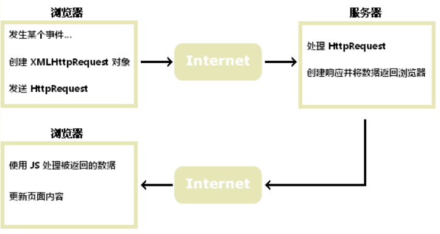

::: tip 摘要
在开发过程中使用的请求方式的区别
<br>
:::

<!-- more -->
## 1 [AJAX](https://www.w3school.com.cn/js/js_ajax_intro.asp)
Ajax即“AsynchronousJavascriptAndXML”（异步 JavaScript 和 XML），是指一种创建交互式网页应用的网页开发技术。它是一种在无需重新加载整个网页的情况下，能够更新部分网页的技术。通过在后台与服务器进行少量数据交换，Ajax 可以使网页实现异步更新。这意味着可以在不重新加载整个网页的情况下，对网页的某部分进行更新。传统的网页（不使用 Ajax）如果需要更新内容，必须重载整个网页页面
### 1.1 如何工作

### 1.2 核心-XMLHttpRequest 对象
所有现代浏览器均支持 XMLHttpRequest 对象（IE5 和 IE6 使用 ActiveXObject）
```js
function ajaxHttpRequestFunc() {
    let xmlHttpRequest;  // 创建XMLHttpRequest对象，即一个用于保存异步调用对象的变量
    if (window.ActiveXObject) { // IE浏览器的创建方式
        xmlHttpRequest = new ActiveXObject("Microsoft.XMLHTTP");
    } else if (window.XMLHttpRequest) { // Netscape浏览器中的创建方式
        xmlHttpRequest = new XMLHttpRequest();
    }
    xmlHttpRequest.onreadystatechange = function () { // 设置响应http请求状态变化的事件
        console.log('请求过程', xmlHttpRequest.readyState);
        if (xmlHttpRequest.readyState == 4) { // 判断异步调用是否成功,若成功开始局部更新数据
            console.log('状态码为', xmlHttpRequest.status);
            if (xmlHttpRequest.status == 200) {
                console.log('异步调用返回的数据为：', xmlHttpRequest.responseText);
                document.getElementById("myDiv").innerHTML = xmlHttpRequest.responseText; // 局部刷新数据到页面
            } else { // 如果异步调用未成功,弹出警告框,并显示错误状态码
                alert("error:HTTP状态码为:" + xmlHttpRequest.status);
            }
        }
    }
    xmlHttpRequest.open("GET", "https://www.runoob.com/try/ajax/ajax_info.txt", true); // 创建http请求，并指定请求得方法（get）、url（https://www.runoob.com/try/ajax/ajax_info.txt）以及验证信息
    xmlHttpRequest.send(null); // 发送请求
}
```
### 1.4 字段解释
| 方法                                          | 描述                                                         |
| :-------------------------------------------- | :----------------------------------------------------------- |
| new XMLHttpRequest()                          | 创建新的 XMLHttpRequest 对象                                 |
| abort()                                       | 取消当前请求                                                 |
| getAllResponseHeaders()                       | 返回头部信息                                                 |
| getResponseHeader()                           | 返回特定的头部信息                                           |
| open(*method*, *url*, *async*, *user*, *psw*) | 规定请求method：请求类型 GET 或 POSTurl：文件位置async：true（异步）或 false（同步）user：可选的用户名称psw：可选的密码 |
| send()                                        | 将请求发送到服务器，用于 GET 请求                            |
| send(*string*)                                | 将请求发送到服务器，用于 POST 请求                           |
| setRequestHeader()                            | 向要发送的报头添加标签/值对                                  |

| 属性               | 描述                                                         |
| :----------------- | :----------------------------------------------------------- |
| onreadystatechange | 定义了当 readyState 属性发生改变时所调用的函数。             |
| readyState         | 保存了 XMLHttpRequest 的状态。0: 请求未初始化1: 服务器连接已建立2: 请求已接收3: 正在处理请求4: 请求已完成且响应已就绪 |
| status             | 200: "OK"403: "Forbidden"404: "Page not found"如需完整列表，请访问 [Http 消息参考手册](https://www.w3school.com.cn/tags/html_ref_httpmessages.asp) |
| statusText         | 返回状态文本（例如 "OK" 或 "Not Found"）                     |

### 1.5 优缺点
**优点：**

1、最大的一点是页面无刷新，用户的体验非常好。

2、使用异步方式与服务器通信，具有更加迅速的响应能力。

3、可以把以前一些服务器负担的工作转嫁到客户端，利用客户端闲置的能力来处理，减轻服务器和带宽的负担，节约空间和宽带租用成本。并且减轻服务器的负担，ajax的原则是“按需取数据”，可以最大程度的减少冗余请求，和响应对服务器造成的负担。

4、基于标准化的并被广泛支持的技术，不需要下载插件或者小程序。

**缺点：**

1、ajax不能使用Back和history功能，即对浏览器机制的破坏。

2、安全问题 AJAX暴露了与服务器交互的细节。

3、对搜索引擎的支持比较弱。

4、破坏了程序的异常机制。

5、不容易调试。

### 1.4 使用场景
1. 表单驱动的交互
2. 深层次的树的导航
3. 快速的用户与用户间的交流响应
4. 类似投票、yes/no等无关痛痒的场景
5. 对数据进行过滤和操纵相关数据的场景
6. 普通的文本输入提示和自动完成的场景
### 1.5 不适用场景
1. 部分简单的表单
2. 搜索
3. 基本的导航
4. 替换大量的文本
5. 对呈现的操纵

## 2 Fetch

### 2.1 是什么？

**fetch是window的一个方法**

Fetch是基于promise设计的。Fetch的代码结构比起ajax简单多。fetch不是ajax的进一步封装，而是原生js，没有使用XMLHttpRequest对象。

### 2.2 使用

1、第一个参数是URL
2、第二个参数可选参数 可以控制不同的init对象
3、使用了js 中的promise对象

```javascript
fetch("url", {
  method: "post",
  headers: {//设置请求的头部信息
    "Content-Type": "application/json"
    //跨域时可能要加上
    //"Accept":"allication/json"
  },    //将arr1对象序列化成json字符串
  body: JSON.stringify(arr1)//向服务端传入json数据
}).then(function (resp) {
  resp.json().then((data) => {
  })
});
```

### 2.3 优缺点

优点：

- 语法简洁，更加语义化
- 基于标准 Promise 实现，支持 async/await
- 更加底层，提供的API丰富（request, response）
- 脱离了XHR，是ES规范里新的实现方式

fetch的缺点：

- fetch只对网络请求报错，对400，500都当做成功的请求，服务器返回 400，500 错误码时并不会 reject，只有网络错误这些导致请求不能完成时，fetch 才会被 reject。
- fetch默认不会带cookie，需要添加配置项： fetch(url, {credentials: 'include'})
- fetch不支持abort，不支持超时控制，使用setTimeout及Promise.reject的实现的超时控制并不能阻止请求过程继续在后台运行，造成了流量的浪费
- fetch没有办法原生监测请求的进度，而XHR可以
- **低版本浏览器和IE浏览器支持性不好**

### 2.4 浏览器支持
Fetch 还不是 W3C 规范，因此原生支持率并不高。
幸运的是，引入下面这些 polyfill 后可以完美支持 IE8+ ：
1. 由于 IE8 是 ES3，需要引入 ES5 的 polyfill: es5-shim, es5-sham
2. 引入 Promise 的 polyfill: es6-promise3.引入 fetch 探测库：fetch-detector
3. 引入 fetch 的 polyfill: fetch-ie8
4. 可选：如果你还使用了 jsonp，引入 fetch-jsonp
5. 可选：开启 Babel 的 runtime 模式，使用 async/await

## 3[ axios](https://www.axios-http.cn/docs/intro)

Axios 是一个基于 [promise](https://javascript.info/promise-basics) 网络请求库，作用于[node.js](https://nodejs.org/) 和浏览器中。 它是 [isomorphic](https://www.lullabot.com/articles/what-is-an-isomorphic-application) 的(即同一套代码可以运行在**浏览器和node.js**中)。在服务端它使用原生 node.js http 模块, 而在客户端 (浏览端) 则使用 XMLHttpRequests。

- 从浏览器创建 [XMLHttpRequest](https://developer.mozilla.org/en-US/docs/Web/API/XMLHttpRequest)
- 从 node.js 创建 [http](http://nodejs.org/api/http.html) 请求
- 支持 [Promise](https://developer.mozilla.org/en-US/docs/Web/JavaScript/Reference/Global_Objects/Promise) API
- 拦截请求和响应
- 转换请求和响应数据
- 取消请求
- 自动转换JSON数据
- 客户端支持防御[XSRF](http://en.wikipedia.org/wiki/Cross-site_request_forgery)